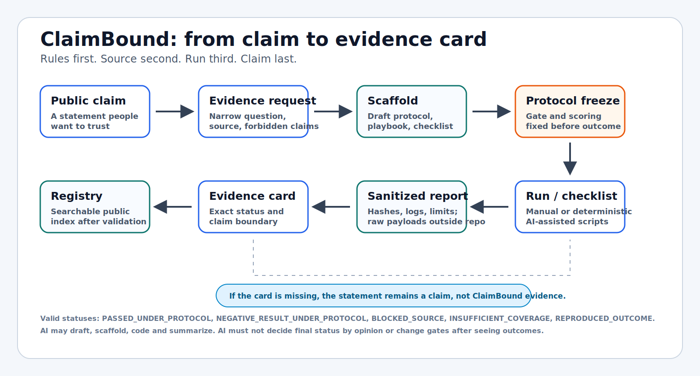
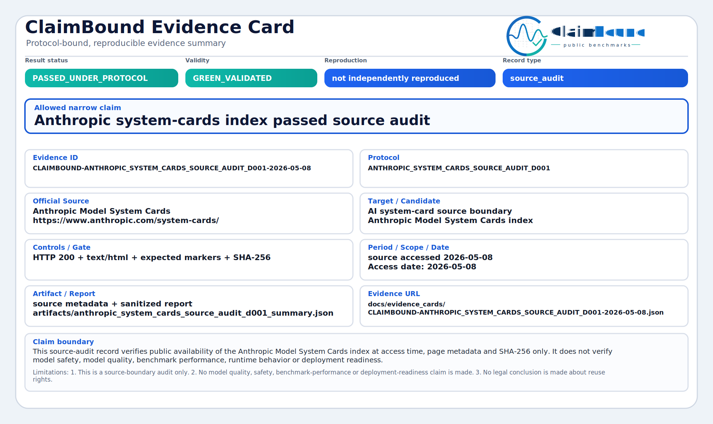
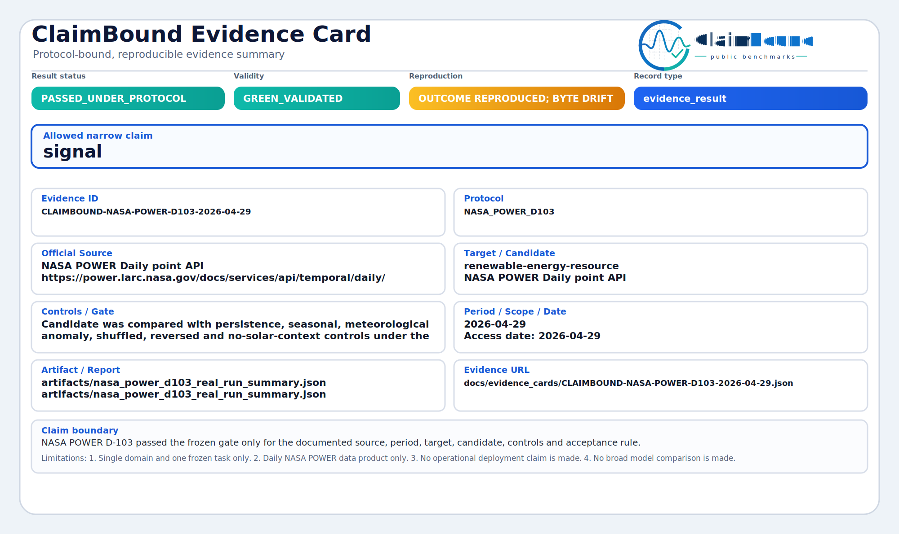
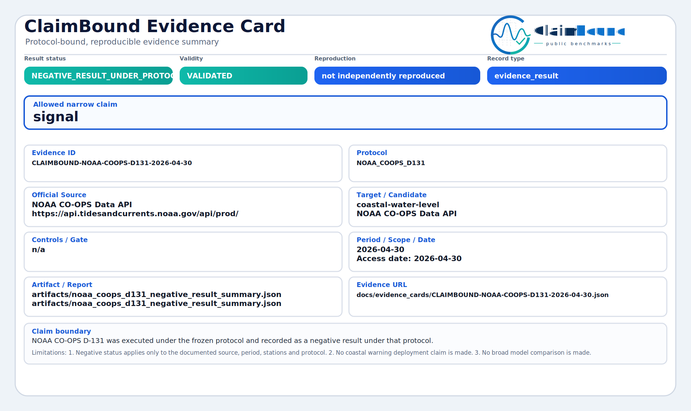

# ClaimBound Public Benchmarks

<p align="center">
  
</p>

ClaimBound turns a narrow public AI, ML or data claim into a small evidence
card: a checkable record with the protocol, source boundary, hashes, exact
result status, claim boundary and reproduction level.

It is not a model leaderboard, production forecasting service or certification
authority. It is an open-source toolkit for asking one plain question:

```text
Where is the evidence?
```

If there is no evidence card, the statement is still only a claim.



## What A Card Shows

An evidence card keeps the useful claim small enough to inspect:

| Card field | Plain meaning |
| --- | --- |
| Claim | The exact public statement being checked. |
| Source | The public source or source documentation used for the check. |
| Protocol | The rules fixed before the result was accepted. |
| Status | Passed, negative, blocked, insufficient or reproduced. |
| Boundary | What the card proves and what it must not be used to claim. |
| Reproduction | Whether another run reproduced the outcome, and with what limits. |

Raw payloads, prompt text, transcripts and restricted source files stay outside
the public repository unless redistribution is clearly allowed. The public
record stores hashes, summaries and links so a local operator or organization
can keep private evidence reproducible without publishing sensitive material.

## Example: AI System-Card Claim

Public claim:

```text
Anthropic publishes a public system-card index for its AI models.
```

ClaimBound narrows it:

```text
Can the official Anthropic system-card page be source-audited by URL, access
date, content type, expected markers and SHA-256 without making any model
safety, model quality or runtime-behavior claim?
```

Current card status:

```text
PASSED_UNDER_PROTOCOL / GREEN_VALIDATED
```

What this proves: the public source boundary passed the documented source-audit
gate at access time.

What it does not prove: that Claude or any Anthropic runtime is safer, better,
unchanged, deployment-ready or benchmark-superior.

[Read the JSON](docs/evidence_cards/CLAIMBOUND-ANTHROPIC_SYSTEM_CARDS_SOURCE_AUDIT_D001-2026-05-08.json)
or open the
[visual SVG card](docs/evidence_cards/CLAIMBOUND-ANTHROPIC_SYSTEM_CARDS_SOURCE_AUDIT_D001-2026-05-08.svg).

## Example Cards

These are deliberately different outcomes: green means a narrow claim passed,
yellow means reproduction is useful but limited, and red means the protocol ran
but the claim did not pass.

<p>
  
  
  
</p>

| Example | Status | What the card proves | Links |
| --- | --- | --- | --- |
| Anthropic system-card source audit | `PASSED_UNDER_PROTOCOL` | The official system-card index passed a narrow public-document source audit. | [JSON](docs/evidence_cards/CLAIMBOUND-ANTHROPIC_SYSTEM_CARDS_SOURCE_AUDIT_D001-2026-05-08.json) / [SVG](docs/evidence_cards/CLAIMBOUND-ANTHROPIC_SYSTEM_CARDS_SOURCE_AUDIT_D001-2026-05-08.svg) |
| NASA POWER D-103 | `PASSED_UNDER_PROTOCOL` with `REPRODUCED_OUTCOME_WITH_SOURCE_BYTE_DRIFT` | The frozen gate-level outcome reproduced, but fresh source bytes differed. | [JSON](docs/evidence_cards/CLAIMBOUND-NASA-POWER-D103-2026-04-29.json) / [SVG](docs/evidence_cards/CLAIMBOUND-NASA-POWER-D103-2026-04-29.svg) |
| NOAA CO-OPS D-131 | `NEGATIVE_RESULT_UNDER_PROTOCOL` | The official-source run completed and honestly did not pass the frozen gate. | [JSON](docs/evidence_cards/CLAIMBOUND-NOAA-COOPS-D131-2026-04-30.json) / [SVG](docs/evidence_cards/CLAIMBOUND-NOAA-COOPS-D131-2026-04-30.svg) |

## Ten Public Use Categories

The registry is easier to understand by audience. Every row below says who the
card helps, what kind of claim it checks, what has been proven so far, and what
to do next.

| Audience / category | Typical task | Current example cards | What we proved | Status and next step |
| --- | --- | --- | --- | --- |
| Public AI transparency readers | Check whether AI vendors publish inspectable public documentation. | Anthropic system cards, OpenAI GPT-5 system-card PDF, Google DeepMind model cards, xAI Grok prompts. | Official public pages or repositories were reachable and hashed under a source-audit boundary. | Green source-audit cards exist. Next: independent reruns and narrower runtime-equivalence requests where sources allow it. |
| AI and LLM evaluation teams | Check whether a benchmark or model claim has model ID, prompt set, scoring rule and transcript hashes. | `MODEL_EVAL_D001`. | The current source did not provide enough material for a fair public evidence result. | `BLOCKED_SOURCE`. Next: provide frozen prompts, model/API metadata, transcript hashes and scoring code. |
| Companies with AI products | Turn a product claim into a customer-readable evidence card. | `AI_PRODUCT_CLAIM_D001`. | The public product announcement was not enough to support an empirical pass/fail claim. | `BLOCKED_SOURCE`. Next: publish exact claim, model/source docs, prompt or transcript manifest and limitations. |
| Independent verifiers and public buyers | Decide what is independently checkable before adopting an AI system. | `PROCUREMENT_AI_D001`. | Procurement evidence needs source, scoring and model metadata before it can become decision support. | `BLOCKED_SOURCE`. Next: run a vendor-claim protocol with frozen sources and stop rules. |
| Data stewards and public-data teams | Verify official source pages, rights notes and raw-payload policy before analysis. | EEA Air Quality source audit, CDC mirror source-boundary artifact. | EEA passed a narrow download-page and rights-link source audit; CDC mirror equivalence remained unresolved. | EEA is green. CDC remains a blocked-source style artifact. Next: complete cards only when source equivalence is clear. |
| Civic tech, journalism and watchdogs | Check claims about mobility, infrastructure, climate or public services against official data. | NYC TLC Phase 4 artifact, `CIVIC_CLAIM_D001`. | Current civic examples show why official source access and frozen gates matter before public claims. | Blocked or artifact-only. Next: add a full evidence card or keep the artifact clearly marked as non-card evidence. |
| Open science and reproducibility teams | Reproduce a published result and keep negative or drift outcomes citable. | NASA POWER D-103, `REPRO_APPENDIX_D001`. | NASA reproduced the gate-level outcome with source-byte drift; the reproduction appendix scaffold still needs stronger source linkage. | NASA is yellow-limited reproduction. Next: add independent rerun records. |
| ML researchers | Separate a narrow method result from broad model-superiority language. | `ML_APPENDIX_D001`. | The current appendix scaffold shows required controls, baselines and claim boundary, but no completed empirical result. | `BLOCKED_SOURCE`. Next: run with frozen controls and publish exact pass/negative/blocked status. |
| Educators | Teach reproducible ML discipline with small public examples. | `EDU_REPRO_D001`. | The classroom track is ready as a scaffold, not as a completed evidence claim. | `BLOCKED_SOURCE`. Next: complete a student-friendly run and publish limitations. |
| Funding reviewers and program evaluators | Read what was promised, which source was used, what happened and what cannot be claimed. | `FUNDING_REVIEW_D001`. | A funding appendix needs protocol, source, status and limitations instead of a narrative success claim. | `BLOCKED_SOURCE`. Next: attach validated cards to reports or proposals. |

For the full card list, see
[docs/evidence_cards/README.md](docs/evidence_cards/README.md). The registry
index is [docs/registry/evidence_index.json](docs/registry/evidence_index.json).

Start with [ClaimBound in 5 minutes](docs/CLAIMBOUND_IN_5_MINUTES.md) for the
plain-language version.

## Install

```bash
uv sync --extra dev
uv run --extra dev python -m pytest -n auto
```

## Quick Start

Create a draft scaffold:

```bash
uv run claimbound new
```

Create the same scaffold non-interactively:

```bash
uv run claimbound new \
  --source-url "https://example.org/source-docs" \
  --protocol-id "EXAMPLE_D001" \
  --domain "public-data" \
  --track-type "source_audit" \
  --execution-mode "MANUAL_NO_AI" \
  --out "docs/manual_audit/EXAMPLE_D001"
```

Run local demo helpers:

```bash
uv run claimbound demo eea-source-audit
uv run claimbound demo grok-source-audit
uv run claimbound validate-all
```

Prepare a local-only run root:

```bash
uv run claimbound run-root \
  --protocol-id EXAMPLE_D001 \
  --source-url https://example.org/source \
  --operator your-name-or-handle
```

`claimbound new` creates a request, protocol draft, playbook, checklist,
operator declaration, draft card and source-probe summary. It is not evidence.
Evidence begins only after an operator freezes the protocol, runs the check,
publishes a sanitized report, validates the card and updates the registry.

## Next Steps: Simple To Technical

| Step | Document | Why read it |
| --- | --- | --- |
| 1 | [ClaimBound in 5 minutes](docs/CLAIMBOUND_IN_5_MINUTES.md) | The shortest plain-language explanation. |
| 2 | [Evidence card examples](docs/evidence_cards/README.md) | Green, yellow, red and blocked examples in one place. |
| 3 | [Getting started](docs/GETTING_STARTED.md) | Installation, local run roots and scaffold commands. |
| 4 | [Result status protocol v0.1](docs/RESULT_STATUS.md) | Exact statuses and the color semantics used by cards. |
| 5 | [Evidence card protocol v0.1](docs/EVIDENCE_CARD.md) | Required JSON fields and validation rules. |
| 6 | [Current evidence tracks](docs/CURRENT_EVIDENCE_TRACKS.md) | What the committed results prove and do not prove. |
| 7 | [Manual audit protocol v0.1](docs/MANUAL_AUDIT_PROTOCOL.md) | How to run a no-AI operator track. |
| 8 | [AI operator protocol v0.1](docs/AI_OPERATOR_PROTOCOL.md) and [AI workflow](docs/AI_WORKFLOW.md) | What AI may draft, run or summarize, and where human approval is required. |
| 9 | [Scaffold workflow protocol v0.1](docs/SCAFFOLD_AUTOMATION_PLAN.md) | How requests become protocol, playbook, checklist and draft card files. |
| 10 | [Registry direction v0.1](docs/GLOBAL_EVIDENCE_REGISTRY.md) and [project next steps](docs/PROJECT_NEXT_STEPS.md) | How validated cards become a public registry and what is intentionally out of scope. |

Individual pre-registration charters live in
[docs/protocols/](docs/protocols/). They are protocol-bound examples, not broad
claims.

## Manual And AI Tracks

Manual tracks are for human operators who complete checklists and record
judgment explicitly. AI-assisted tracks are for cases where an AI agent may
draft scaffolds, write deterministic runner code or summarize reports. In both
tracks, the final status must come from a protocol, checklist, runner or
validator, not from model opinion.

Useful entry points:

- [No-AI EEA manual track](docs/manual_audit/EEA_AQ_D001_MANUAL_TRACK.md)
- [AI-assisted EEA track](docs/manual_audit/EEA_AQ_D001_AI_ASSISTED_TRACK.md)
- [Audience workflows](docs/AUDIENCE_TESTIMONIAL_WORKFLOWS.md)
- [Demo tracks to evidence cards](docs/DEMO_TRACKS_TO_EVIDENCE_CARDS.md)

## Boundary

This repository is independently usable as an open benchmark foreground. It
does not include, import or require private background technology.

The registry stores validated card metadata and sanitized report references, not
raw payloads. Blockchain, token, wallet, on-chain storage and chain timestamp
features are outside the current roadmap.

## Community

- [Contributing guide](CONTRIBUTING.md)
- [Code of Conduct](CODE_OF_CONDUCT.md)
- [Security policy](SECURITY.md)
- [Discussions: maintainer announcements and community Q&A](https://github.com/ClaimBound/claimbound-public-benchmarks/discussions)

## License

Apache-2.0. See [LICENSE](LICENSE).
